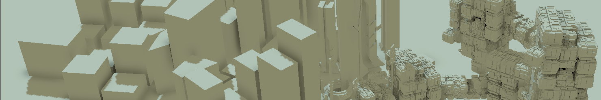
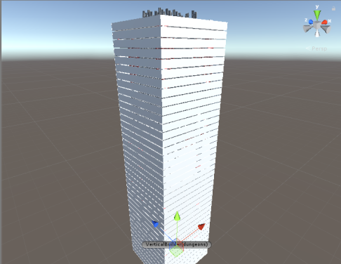
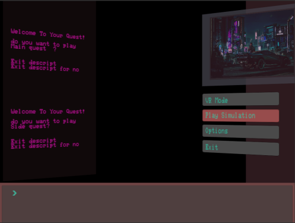
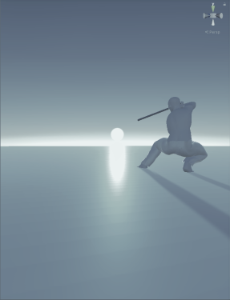
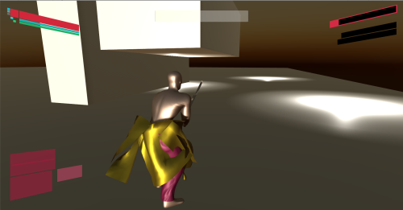

# Hi there!
 
<text >You stumble upon the portfolio of Devanaboina Sai Vamshi
(GamePlay Programmer, Game Collector, game technology enthusiast)

<div class="simple_overlay" id="mies1">
  <!-- large image -->

 <div class="simple_overlay" id="mies2">
 hmmm.......
</div>
</div>


## Major Project(Project Cybernet)

Currently Working on my (**Rapid Prototype**)**[Major Project](https://youtu.be/oo1xqFDnayA)**, Which is an Semi-Open World FPS Action RPG made in Unity, I have also

### Build tools for designers to easy create vertical cities for the game


### Build an Quest System Tool for designers for Interactive StoryTelling 


### Made an Sword Combat System for Cyber Samurai Class in the Game Project Cybernet 


### Did Animation Programming with VFX Integrated


### Elevator Mechanic For the Game


worked on Other Game Engines like 
Unreal,Game Maker,RPG Maker
Worked on Libraries like LibGDX, Box2D, OpenGL, WebGL

## FunSide Projects

Made More Than 3 Unpublished Mobile Games


## Here are Games That was published Till now for free on Itch.io [Checkout](https://bustingjam.itch.io/)

I have also participated in Number of Game Jams like 

-**IGDC**

-**Nasscom**

-Unreal Jam

-**Brackeys Game Jam and many more**

-**Also worked on AR boardgame made in Unity**

## Worked on TeamProjects

I have worked on Games like:-

-**De-light(Gameplay Programmer)**

-Getout(as asset modeller)

-**Farm In Harm(Gameplay Programmer)**

[-**Brain's Life(GamePlay Programmer)**](https://www.youtube.com/watch?v=9DbjPjFcU34&t=3s)

-**Refugee(Junior Programmer , Asset Modeller)**


## Interesting Mechanics for 2d parkour Game 
 
 Automatic Parkour System using Raycasts in Unity


### this is Interesting code blocks of the Game Spectrum 
```markdown
Code that i am Proud of written in java for the game Spectrum which was inspired from a game called "Hue"
 private Body createbody1(float x , float y , float width, float height, boolean isStatic , World world){


        //--------Create------//

        if (isStatic)
            bodyDef.type = BodyDef.BodyType.StaticBody;
        else
            bodyDef.type = BodyDef.BodyType.DynamicBody;
        bodyDef.position.set(x / PPM, y / PPM);
        //.fixedRotation = true;


        PolygonShape shape = new PolygonShape();
        shape.setAsBox(width / 2 / PPM, height / 2 / PPM);          // taking bodies position
        fixtureDef.shape = shape;
        fixtureDef.friction = 0.5f;
        fixtureDef.restitution = 0.0f;
        fixtureDef.density = 0.0f;

        this.body = world.createBody(bodyDef);
        this.body.createFixture(fixtureDef).setUserData(this);


        return body;

    }
 
```
this is small chuck of code that was used in Spectrum Game
```markdown
//fasinated codeblock written in java
  public void beginContact(Contact contact) {


                                         fix  = contact.getFixtureA();
                                         fix1 = contact.getFixtureB();


    if(contact.getFixtureA().getBody() ==crate && contact.getFixtureB().getBody() == Texbody
                         ||contact.getFixtureA().getBody() ==Texbody && contact.getFixtureB().getBody() == crate){

                              System.out.print("Collision happend");
                              // player.destroyFixture(fixture1);
                            ((Game)Gdx.app.getApplicationListener()).setScreen(new level2());// this is used for screen change

                                         }

 
```
level design and color change in the game 
```markdown
//fasinated codeblock written in java

   public void Colorchange(float r , float g , float b , float a) {

      // r = 0; g = 0.0f ; b = 0.0f; a = 1.0f;

        rayH.setAmbientLight(r, g, b, a);
    }
    //this is how i level designed my game
    
    batch.draw(tex,1000,-280,200,200);
        batch.draw(tex,800,-280,200,200);
        batch.draw(tex,600,-280,200,200);
        batch.draw(tex,0,-280,200,200);
        batch.draw(tex,400,-280,200,200);
        batch.draw(tex,600,-280,200,200);
        batch.draw(tex,200,-280,200,200);
        batch.draw(tex,-200,-280,200,200);
        batch.draw(tex,-400,-280,200,200);
        batch.draw(tex,-600,-280,200,200);
        batch.draw(tex,-800,-280,200,200);
        batch.draw(tex,-1000,-280,200,200);

        //titles of the top platform
        batch.draw(tex,1000,160,200,200);
        batch.draw(tex,800,160,200,200);
        batch.draw(tex,0,  160,200,200);
        batch.draw(tex,400,160,200,200);
        batch.draw(tex,600,160,200,200);
        batch.draw(tex,200,160,200,200);
        batch.draw(tex,-200,160,200,200);
        batch.draw(tex,-400,160,200,200);
        batch.draw(tex,-600,160,200,200);
        batch.draw(tex,-800,160,200,200);
        batch.draw(tex,-1000,160,200,200);
        batch.end();
        
        
    
```
for Optimization in the Physics Library
```markdown
//this is how i have destroy objects in the game
 Obstruc.setActive(false);
 Obstruc1.setActive(false);
 Obstrcu2.setActive(false);
 ```
 
### Resume 
[CheckoutResume](https://github.com/duxWonderlot/DevanaboinaSaiVamshi/blob/master/D%20Sai%20Vamshi%20resume%20pdf.pdf) 
 
### Contact
You can contact me from [LinkedIn](https://in.linkedin.com/in/devanaboina-sai-vamshi-218300156)
 
### CopyRight© 2019 [duxWonderlot](https://duxwonderlot.github.io/portfolio/). All Rights Reserved.

.hovereffect {
  width: 100%;
  height: 100%;
  float: left;
  overflow: hidden;
  position: relative;
  text-align: center;
  cursor: default;
}

.hovereffect .overlay {
  width: 100%;
  height: 100%;
  position: absolute;
  overflow: hidden;
  top: 0;
  left: 0;
}

.hovereffect img {
  display: block;
  position: relative;
  -webkit-transition: all 0.4s ease-in;
  transition: all 0.4s ease-in;
}

.hovereffect:hover img {
  filter: url('data:image/svg+xml;charset=utf-8,<svg xmlns="http://www.w3.org/2000/svg"><filter id="filter"><feColorMatrix type="matrix" color-interpolation-filters="sRGB" values="0.2126 0.7152 0.0722 0 0 0.2126 0.7152 0.0722 0 0 0.2126 0.7152 0.0722 0 0 0 0 0 1 0" /><feGaussianBlur stdDeviation="3" /></filter></svg>#filter');
  filter: grayscale(1) blur(3px);
  -webkit-filter: grayscale(1) blur(3px);
  -webkit-transform: scale(1.2);
  -ms-transform: scale(1.2);
  transform: scale(1.2);
}

.hovereffect h2 {
  text-transform: uppercase;
  text-align: center;
  position: relative;
  font-size: 17px;
  padding: 10px;
  background: rgba(0, 0, 0, 0.6);
}

.hovereffect a.info {
  display: inline-block;
  text-decoration: none;
  padding: 7px 14px;
  border: 1px solid #fff;
  margin: 50px 0 0 0;
  background-color: transparent;
}

.hovereffect a.info:hover {
  box-shadow: 0 0 5px #fff;
}

.hovereffect a.info, .hovereffect h2 {
  -webkit-transform: scale(0.7);
  -ms-transform: scale(0.7);
  transform: scale(0.7);
  -webkit-transition: all 0.4s ease-in;
  transition: all 0.4s ease-in;
  opacity: 0;
  filter: alpha(opacity=0);
  color: #fff;
  text-transform: uppercase;
}

.hovereffect:hover a.info, .hovereffect:hover h2 {
  opacity: 1;
  filter: alpha(opacity=100);
  -webkit-transform: scale(1);
  -ms-transform: scale(1);
  transform: scale(1);
}

 
